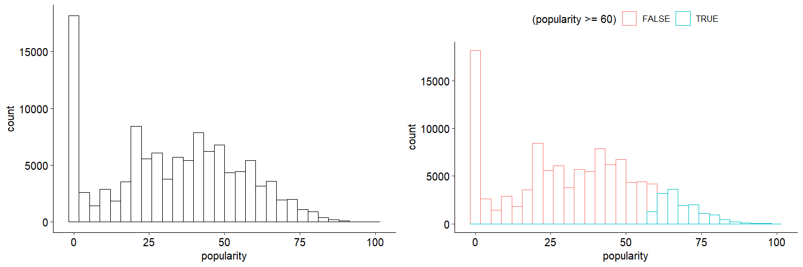
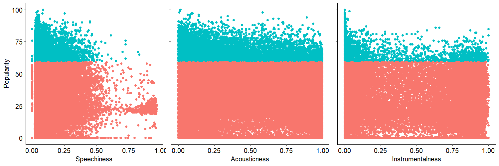
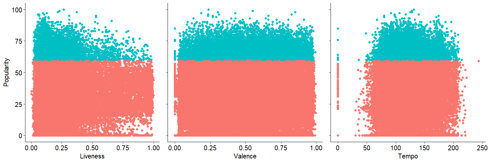

# **Project Objective**

------------------------------------------------------------------------

The goal of this project is to model a complex dataset using in-depth statistical analysis and identify the key factors of popular tracks. The dataset is available on [Kaggle](https://www.kaggle.com/datasets/maharshipandya/-spotify-tracks-dataset?resource=download), and it includes information about 125 different genres of Spotify tracks.

# **Dataset**

------------------------------------------------------------------------

The `dataset.csv` contains the track information on Spotify for 125 different genres. A regression model is fitted to the dataset to assess the relationship between the popularity of a track ('***popularity***') in a scale of 0 \~ 100, with 100 being the most popular, and the following variates of interested:

-   ***duration_ms***: The track length in milliseconds.

-   ***danceability***: *Danceability* describes how suitable a track is for dancing based on a combination of musical elements including *tempo, rhythm stability, beat strength,* and overall *regularity*. (A value of 0.0 is least danceable and 1.0 is most danceable)

-   ***energy***: *Energy* is a measure from 0.0 to 1.0 and represents a perceptual measure of intensity and activity. (An energetic tracks feel fast, loud, and noisy)

-   **key**: The *key* of a track is an integers (-1 \~ 11) map to pitches using standard Pitch Class notation. (`0 = C`, `1 = C♯/D♭`, `2 = D`, and so on; If no key was detected, the value is -1)

-   **loudness**: The overall *loudness* of a track in decibels (dB).

-   **mode**: *Mode* indicates the modality (major = 1 or minor = 0) of a track.

-   **speechiness**: *Speechiness* detects the presence of spoken words in a track.

    -   The more exclusively speech-like the recording (e.g. talk show, audio book, poetry), the closer to 1.0 the attribute value.

    -   Values above 0.66 describe tracks that are probably made entirely of spoken words.

    -   Values between 0.33 and 0.66 describe tracks that may contain both music and speech, either in sections or layered, including such cases as rap music.

    -   Values below 0.33 most likely represent music and other non-speech-like tracks

-   **acousticness**: A confidence measure from 0.0 to 1.0 of whether the track is *acoustic*. (1.0 represents high confidence the track is acoustic)

-   **instrumentalness**: Predicts whether a track contains *no* *vocals*. (The closer the instrumentalness value is to 1.0, the greater likelihood the track contains no vocal content)

-   **liveness**: Detects the *presence of an audience* in the recording. Higher liveness values represent an increased probability that the track was performed live. (A value above 0.8 provides strong likelihood that the track is live)

-   **valence**: A measure from 0.0 to 1.0 describing the musical *positiveness* conveyed by a track. Tracks with high valence sound more positive. (e.g. happy, cheerful, euphoric)

-   **tempo**: The overall estimated *tempo* of a track in beats per minute (BPM).

-   **time_signature**: The *time signature* (meter) is a notational convention to specify how many beats are in each bar (or measure). (A ranges from 3 to 7 indicating time signatures of `3/4`, to `7/4`)

-   **track_genre**: The *genre* in which the track belongs.

The data analysis file is `statistical_analysis.R`.

# **Data Exploration**

------------------------------------------------------------------------

## The summary of numerical variables

| Variable            | Mean    | Variance    | Min-Median-Max           | 1st Qu. - 3rd Qu. |
|---------------|---------------|---------------|---------------|---------------|
| Popularity (Target) | 33.24   | 22.31\^2    | 0 - 35 - 100             | 17 - 50           |
| 1 duration_ms       | 228029  | 107297.7\^2 | 0 - 212906 -5237295      | 174066 - 261506   |
| 2 danceability      | 0.5668  | 0.17\^2     | 0 - 0.58 - 0.985         | 0.456 - 0.695     |
| 3 energy            | 0.6414  | 0.25\^2     | 0 - 0.685 - 1            | 0.472 - 0.854     |
| 4 key               | 5.309   | 3.56\^2     | 0 - 5 - 11               | 2 - 8             |
| 5 loudness          | -8.259  | 5.03\^2     | -49.531 - -7.004 - 4.532 | -10.013 - -5.003  |
| 6 mode              | 0.6376  | 0.48\^2     | 0 - 1 - 1                | 0 - 1             |
| 7 speechiness       | 0.08465 | 0.11\^2     | 0 - 0.0489 - 0.965       | 0.0359 - 0.0845   |
| 8 acousticness      | 0.3149  | 0.33\^2     | 0 - 0.169 - 0.996        | 0.0169 - 0.5980   |
| 9 instrumentalness  | 0.156   | 0.31\^2     | 0 - 4.16e-5 - 1          | 0 - 0.049         |
| 10 liveness         | 0.2136  | 0.19\^2     | 0 - 0.132 - 1            | 0.098 - 0.273     |
| 11 valence          | 0.4741  | 0.26\^2     | 0 - 0.464 - 0.995        | 0.26 - 0.683      |
| 12 tempo            | 122.15  | 29.98\^2    | 0 - 122.02 - 243.37      | 99.22 - 140.07    |
| 13 time_signature   | 3.904   | 0.43\^2     | 0 - 4 - 5                | 4 - 4             |

## The distribution of target variable in dataset `dataset.csv`

The distribution of the target variable `popularity` is shown below. The histogram of track popularity shows that the majority of tracks are very unpopular, because there are too many tracks with 0 popularity, and only a small percentage of tracks are popular (in this case, popular $\implies$ populary $\geq 60$), with mean popularity $\leq 40$ (red fitted normal distribution). This pattern indicates than the distribution of the dataset is unbalanced (i.e. too many 0 popular tracks), and it is necessary to modify the dataset such as removing all records with 0 popularity.



## The distribution of explainatory variable v.s. popularity

It is difficult to see a strong linear ralationship between the explainatory variables and the popularity (cyan - popular, red - unpopular), and the linear regression model may difficult to fit the dataset well. Moreover, there is a weak linear/quadratic relationship among some explainatory variables such as loudness vs energy and dancibility vs tempo.

  


The heat plot of covariance among explainatory variables is shown below. Overall, most variables are uncorrelated, but there are still some potential issues with multicollinearity; For example, 'acousticness' is negatively correlated with 'energy' and 'loudness' (covariance $= -0.73, -0.59$), and 'loudness' is strongly positively correlated (covariance $= 0.76$) with 'energy', which may potentially cause problems when fitting a linear regression model.


## Dataset Summary

There may be issues if the dataset is used directly to fit the model.

-   There are too many tracks with popularity $= 0$ (16020 tracks, $\approx 14$ %)
-   Multicollinearity may cause problems (acousticness-energy and loudness-energy)

# **The linear regression model**

------------------------------------------------------------------------

Since the linear regresssion model is the simplest statistical model ("Simple is good!!"), it was the model that was applied to the dataset. For the purpose of evaluating the model, a linear regresssion model can also predict an exact popularity score for a track. It is also essential to filter and split the raw dataset (train/test - 70/30) and determine which features need to be transformed or eliminated in order to fit the model well.

Before applying data filtering and variable transformation, the initial linear regression model has a multiple R-squared value of 0.06506 (only $6$% of variation in popularity accounted for by model variates).

```         
lm(formula = popularity ~ duration_ms + danceability + energy + 
    key + loudness + mode + speechiness + acousticness + instrumentalness + 
    liveness + valence + tempo + time_signature)

Residuals:
    Min      1Q  Median      3Q     Max 
-46.982 -13.627   0.022  13.407  57.420 

Coefficients:
                   Estimate Std. Error t value Pr(>|t|)    
(Intercept)       5.027e+01  9.612e-01  52.295  < 2e-16 ***
duration_ms      -8.630e-06  6.809e-07 -12.674  < 2e-16 ***
danceability      7.743e+00  5.032e-01  15.386  < 2e-16 ***
energy           -7.663e+00  5.808e-01 -13.194  < 2e-16 ***
key              -4.421e-02  2.019e-02  -2.190  0.02851 *  
loudness          2.560e-01  2.564e-02   9.986  < 2e-16 ***
mode             -5.897e-01  1.503e-01  -3.922 8.78e-05 ***
speechiness      -1.809e+01  6.810e-01 -26.569  < 2e-16 ***
acousticness     -1.651e+00  3.293e-01  -5.014 5.35e-07 ***
instrumentalness -1.209e+01  2.706e-01 -44.689  < 2e-16 ***
liveness         -2.287e+00  3.893e-01  -5.873 4.29e-09 ***
valence          -7.841e+00  3.413e-01 -22.975  < 2e-16 ***
tempo            -7.307e-03  2.471e-03  -2.957  0.00311 ** 
time_signature    7.234e-01  1.694e-01   4.271 1.95e-05 ***
---
Signif. codes:  0 ‘***’ 0.001 ‘**’ 0.01 ‘*’ 0.05 ‘.’ 0.1 ‘ ’ 1

Residual standard error: 18.57 on 68572 degrees of freedom
Multiple R-squared:  0.06506,   Adjusted R-squared:  0.06488 
F-statistic:   367 on 13 and 68572 DF,  p-value: < 2.2e-16
```

The performance of the model is shown below. It shows that this model is difficult to accurately predict tracks with high popularity. This issue may caused by the insufficience of data of popular tracks.

 

There are also some issue within the dataset. The multi-collinearity problem is then assessed by VIF coefficients of benchmark $= 5$, and the varibale 'energy', 'loudness', and 'acousticness' have higher VIF value with $4.222973$, $3.261579$, and $2.353495$, respectively, compared to other variables, while all lower than $5$. The significance of features are assess by the hypothesis test and p-values, and 4 features should be removed ('key', 'mode', 'tempo', and 'time_signature' with p-values $>0.05$). The distribution of each feature is plotted to determine an appropriate transformation, and the unit of duration is converted into minute.

 

-   'duration_ms' - too right skewed.

-   'speechiness' - almost all tracks are music and non-speech-like

-   'acousticness', 'instrumentalness', 'liveness' - highly right skewed (range 0 \~ 1) 'danceability',

-   'valence', 'tempo' - bell shaped, normal distributed

After eliminating the insignificant features and multi-collinearity problems, the results of the linear regression model is as follows:

```         
lm(formula = popularity ~ duration_m + danceability + energy + 
    loudness + speechiness + acousticness + instrumentalness + 
    liveness + valence)

Residuals:
    Min      1Q  Median      3Q     Max 
-46.768 -13.640  -0.013  13.373  56.605 

Coefficients:
                  Estimate Std. Error t value Pr(>|t|)    
(Intercept)       51.21407    0.65629  78.036  < 2e-16 ***
duration_m        -0.51286    0.04084 -12.557  < 2e-16 ***
danceability       8.35660    0.49282  16.957  < 2e-16 ***
energy            -7.57585    0.57904 -13.083  < 2e-16 ***
loudness           0.25322    0.02558   9.899  < 2e-16 ***
speechiness      -18.15862    0.68016 -26.697  < 2e-16 ***
acousticness      -1.67799    0.32860  -5.107 3.29e-07 ***
instrumentalness -12.07620    0.27033 -44.672  < 2e-16 ***
liveness          -2.27516    0.38866  -5.854 4.83e-09 ***
valence           -7.97455    0.34001 -23.454  < 2e-16 ***
---
Signif. codes:  0 ‘***’ 0.001 ‘**’ 0.01 ‘*’ 0.05 ‘.’ 0.1 ‘ ’ 1

Residual standard error: 18.58 on 68576 degrees of freedom
Multiple R-squared:  0.06445,   Adjusted R-squared:  0.06433 
F-statistic: 524.9 on 9 and 68576 DF,  p-value: < 2.2e-16
```

 
